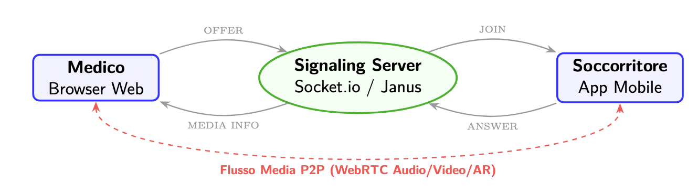
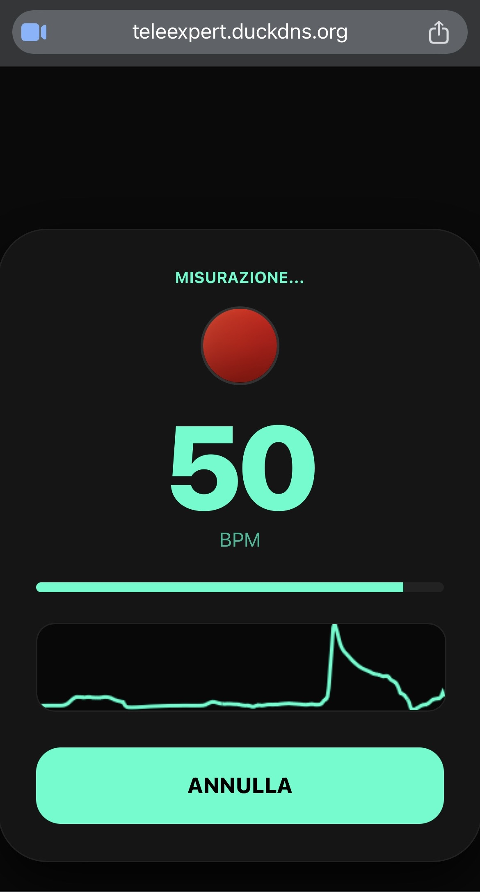

# TeleExpertAR

## Visione del Progetto 📌
**TeleExpert** AR è una piattaforma sperimentale di **teleassistenza** progettata per dimostrare l’integrazione di tecnologie di **comunicazione real-time**, streaming multimediale e analisi di segnali biometrici all’interno di un unico sistema distribuito basato su tecnologie web standard.  

## Architettura del Sistema 🏗️
Il progetto implementa un’**architettura client-server** in cui un soccorritore sul campo può trasmettere il flusso video della fotocamera del proprio smartphone a un medico remoto, consentendo un supporto operativo immediato durante situazioni di emergenza.

  

### Comunicazione Real-Time
La comunicazione tra i dispositivi avviene tramite il protocollo **WebRTC**, che permette la trasmissione diretta di flussi audio e video con **bassa latenza**.  

Per consentire l’instaurazione della connessione tra i client è stato realizzato un **server di signaling** basato su **Node.js** e **WebSockets**, responsabile dello scambio delle informazioni di sessione necessarie alla negoziazione della connessione **peer-to-peer**. Questa architettura consente di separare la fase di coordinamento della comunicazione dalla trasmissione effettiva dei flussi multimediali.  

## Funzionalità Avanzate 🧬
Oltre alla trasmissione video, il sistema è stato progettato per supportare funzionalità avanzate di **monitoraggio e collaborazione remota**. In particolare, il progetto prevede l’estrazione di **parametri biometrici**, come il battito cardiaco, direttamente dal flusso video attraverso tecniche di **fotopletismografia (PPG)**, consentendo l’analisi in tempo reale di segnali fisiologici senza l’utilizzo di sensori esterni dedicati.  

  

L’**architettura modulare** del sistema consente inoltre l’integrazione di componenti avanzati, come un **media server WebRTC** per la gestione scalabile dei flussi multimediali e sistemi di **realtà aumentata collaborativa** per guidare visivamente le operazioni del soccorritore.  

## Conclusioni 🎯
Il progetto dimostra come l’utilizzo combinato di **protocolli web standard** e tecnologie di comunicazione real-time possa essere impiegato per sviluppare sistemi innovativi applicabili in contesti critici come la **telemedicina** e la **gestione delle emergenze**.

## WebSite 🌐
Per visualizzare il sito, cliccare al seguente link:
[Website](https://teleexpert.duckdns.org/)
